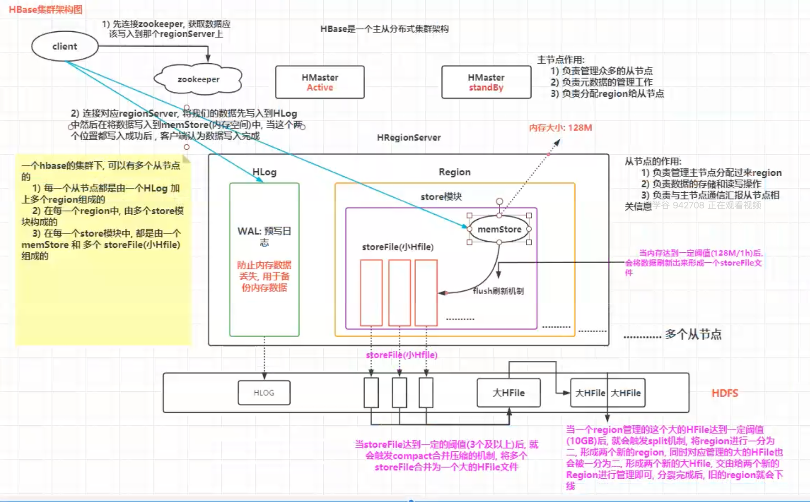
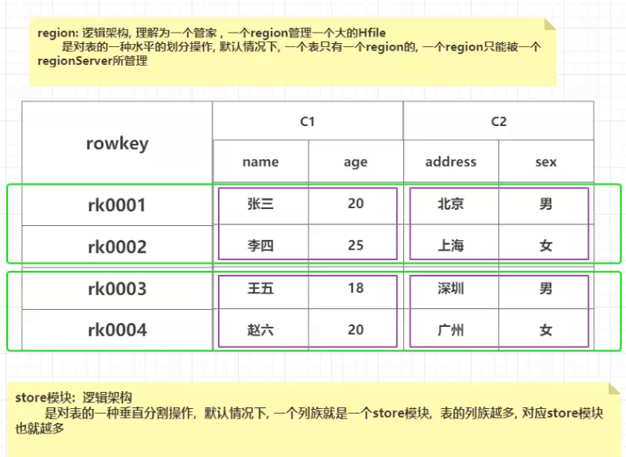

# hbase
hbase

hbase 高可用集群
hbase的高可用
hbase的高可用,主要指的让hbase集群的主节点高可用,目前hbase集群中,主节点只有一台,一旦主节点宕机,整个集
群缺失主节点,希望主节点可以有多台,当其中一台宕机后,其他的的备份主节点可以顶上来
如何配置hbase的高可用呢?
。1)在hbase的conf目录下,创建backup-masters文件
cd/export/server/hbase-2.1.0/conf/

vim backup-masters
添加以下内容:
node2.itcast.cn
node3.itcast.cn

°2)将这个文件发送到node2和node3中
cd/export/server/hbase-2.1.0/conf/
scp -r backup-masters node2:$PWD
scp -r backup-masters node3:$PWD

3)重启hbase集群
停止hbase集群:
在node1执行:stop-hbase.sh
或者.通过jps将各个节点的hbase进程全部杀死
启动hbase集群:
在node1执行:start-hbase
单独启动某一台的master:
hbase-daemon.sh start master
单独启动某一台的从节点
hbase-daemon.sh start regionserver

架构图

