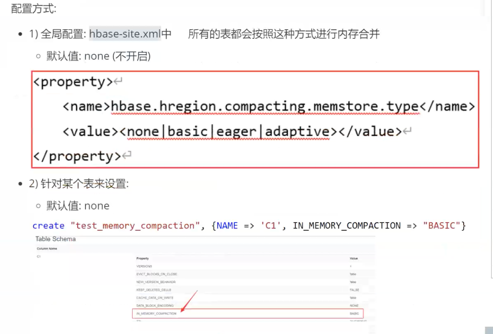
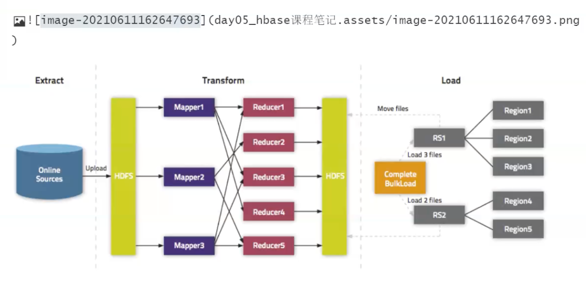

# hbase
hbase
## 1.hbase的基本介绍
hbase产生背景
hdfs是一款吞吐量极高,适合于进行批量处理的工作,但是随机读写能力比较差(压根不支持),所以如果现在需要进行
随机读写的操作,此时HDFS就无能为力,所以迫切需要一款软件能够帮助实现高效的随机读写操作
hbase的基本介绍:
properties
### 1)hbase是一款noSQL型数据,不支持SQL.不支持join的操作,没有表关系,不支持事务(多行事务)
### 2)hbase是基于Google发布bigTable论文产生一款软件
### 3)hbase是采用java语言编写
### 4)hbase是基于HDFS的,数据最终是存储在HDFS上,如果想想思要启动HBase必须先启动HDFS
### 5)查询hbase中数据一般有三种方案:
#### 5.1:根据主键(rowkey)查询
#### 5.2:根据主键的范围检索
#### 5.3:查询全部数据
存储结构化和半结构化数据

导入的语法:
hbase org.apache.hadoop.hbase.mapreduce.Import 表名HDFS数据文件路径
注意:此命令需要在Linux的shell窗口下执行
执行操作:
1)先将资料中10w抄表数据上传到Linux中:
rz上传即可
在从Linux中上传hdfs的:/hbase/water_bill/input
hdfs dfs -mkdir -p /hbase/water_bill/input
hdfs dfs -put part-m-0000_10w /hbase/water_bill/input
3)执行导入操作:前提表必须存在
hbase org.apache.hadoop.hbase.mapreduce.Import WAITER_BILL /hbase/water_bill/input/part-m-00000_10w
选择语言
导出语法:
hbase org.apache.hadoop.hbase.mapreduce.Export 表名 HDFSS输出数据文件路径

## hbase 读写流程

## hbase 三个机制：flush storeFile 合并机制 split 切分机制

### 1.flush 
flush刷新机制:
当客户端不断向memstore写入数据,memstore中数据达到一定的阈值后,就会触发这个flush的刷
新机制,最终将数据刷新到HDFS上,形成一个storeFile文件

<b>阈值:128M/1h</b>

flush内部的流程机制:
1)当memstore达到阙值后,首先会先将当前这个memstore空间关闭,然后开启一个新的 memstore接着进行写入操作
2)将这个已经关闭的空间的数据(segment片段)放置到一个pipeline管道中,pipeline管道 是一个只读管道,等待进行flush到HDFS操作
hbase2.x以上架构:
存储在pipeline中数据会尽可能晚的刷新到HDFS上,让更多的的数据能够存储在 pipeline管道中,以提升查询的效率,减少后续的I0读写操作
当整个region内存空间达到阈值,此时一次性将pipeline管道中全部写入到HDFS 上,在写入过程,会将多个片段数据进行内存合并操作,将其合合并为一个storeFile写入到HDFS上
hbasel.x架构:一旦数据到达pipeline管道后,flush子线程检测到pipeline管道中 有数据,直接将其flush到磁盘上形成一个storeFile文件
注意:
虽然说在hbase2.x提供了内存合并的方案,但是这种方案默认情况下是没有开启的,也就意味着在默认情况和hbase1.x是一样的

### 内存合并 storeFile
如何配置内存合并操作:
在内存合并的时候,主要可以采取三种合并方案:
basic(基础型):
在进行内存合并的时候,并不关心内存中数据是否有出现过期版本或者已经标记删除数据,直接 进行合并即可
此种操作合并效率比较高
eager(饥渴型):
在进行内存合并的时候,观察数据是否已经发生过期,或者这条数据是否已经出现被打上删除标 记信息,如果发现有,在合并的时候,直接将这些过滤掉,可以保证合并的文件更小,而且当前这个文件也 没有过期的数据了
适用于:数据会经常过期的场景,比如购物车
此种操作,效率比较低
adaptive(适应型):
在进行内存合并的时候,会校验整个数据集过期的数据是否比较多,如果比较多,自动采用饥渴型解决,如果发现没有太多过期数据,采用基础型方案
在实际生产中,一般会配置什么呢?一般使用basic !或者
eager
根据实际数据的特点选择对应方案

### hbase 合并机制
compact合并机制:
当flush不断的被触发,在HDFS上就会形成越来越多的storeFile文件,当storeFile达到一定的阈值后,就会触发compact合并压缩的机制操作
minor:将多个小的storeFile合并为一个较大的Hfile过程
触发阈值:达到3个及以上或者在启动Hbase的时候进行检测
注意:
minor在合并过程中,仅对数据进行排序操作,并不关心数据是否存在过期以及已经打上删除标 记
minor在执行合并效率比较高
在合并的时候,也是需要将这些数据边读取到内存,然后边通过追加的方式合并到HDFS上
major:将这个较大的Hfile合并之前大的Hfile进行合并成最终一个大的Hfile过程
触发阈值:7天或者在启动Hbase的时候检测
注意:
major在进行合并操作的时候,会将之前较大的Hfile和当前的这个大的Hfile进行最终合并为
一个Hfile操作,此时由于可以拿到region下所有的数据,所以在合并过程中,如果发现有些版本数据已
经过期,或者说已经被标记删除了,在合并的过程中将处理清洗掉,保证大的Hfile中不存在过期或者标记 删除的数据
由于此操作需要处理的数据量比较庞大,整个执行对当前regionserver影响比较高,一般建议关闭
自动触发,改为手动(在不是很繁忙的时候触发执行即可)

hbase和HDFS存在一些矛盾关系:hdfs不支持随机读写,但是基于HDFS的hbase却支持高效的随机读写
1)在进行写入修改删除操作的时候,对于hbase都是一种:添加数据的操作,而且都是将数据添加到
内存中(从而提升写入数据性能)
2)那么一旦修改后,或者删除后,之前的版本的数据可能就会过期,这些过期的时候就要分为二个阶
段来处理:
第一个阶段:内存合并阶段
第二个阶段:major合并阶段
此阶段只能将当前在内存中过期数据清除掉
此阶段将会进行完整的清除工作
3)所有在写入到HDFS的数据都是采用追加的方式进行写入操作
4)hbase为了提供读取数据的性能,专门定义一种hbasee独有的文件格式:HFile此文件中存储大
量的索引信息数据,从而保证能够更快检索数据,同时每个region定义存储数据范围,能够快速找到对应
的文件
<!-- 3个G就进行合并 -->
<property>
<name>hbase.hstore.compaction.min</name>
<value>3</value>
<final>false</final>
<source>hbase-default.xml</source>
</property>
<!-- 7天执行一次 -->
<property>
<name>hbase.hregion.majorcompaction</name>
<value>604800000</value><
<source>hbase-default.xml</source>
</property>e

### hbase split切分机制
默认情况下,当一个region所管理的Hfile文件达到10GB的时候,就会触发split分裂机制,此时会将
region进行一分为二,形成两个新的region,而region对应管理Hfile也会进行一分为二,形成两个新的
Hfile,这个两个hfile与两个新的region--对应管理即可,一旦分裂完成后,旧的region和对应数据就
会下线并删除

会导致这个regionserver整个读写效率的下降,甚至会出现现宕机的风险
如何解决问题呢?
是否可以让表在一开始创建的时候,就可以拥有多个region呢:hbase的预分区
是否可以表尽可能快的分裂出多个region来:region的分裂
但是默认情况下,region是达到10GB,才会进行分裂,那么从0~10GB等待时间貌似有点太长了,
所以这样也不是特别合适,hbase为了解决这个问题,专门是供了一个算法公式,来计算何时进行分裂操
Min(RA2 * "hbase.hregion.memstore.flush.size", "hbbase.hregion.max.filesize"
说明:R表示一个表的region数量
基于以上公式,可以看出分裂的时间:
第一次:当region达到128M的时候,就会触发一次的region的分裂操作
第二次:当region达到512M的时候,救护粗发一次region的分裂操作
第三次:
依次类推,知道region的数量达到9个的时候,此时min计算后的值就是10GB在以后即使按照
10GB进行分裂
<--Region最大文件大小为10G--><
<property>
<name>hbase.hregion.max.filesize</name>
<value>10737418240</value>
<final>false</final>e
<source>hbase-default.xml</source>
</property>

### 8.8 master分配region的流程
当master启动后,首先会先和各个从节点进行通信,让各个从节点汇报自己的目前所管理的region信 息
master会再去读取meta表,从中获取到所有的region信息
3)根据meta表中region信息以及各个 从节点汇报上来region进行比对,查找出那些region还没有 分配,或者说那个从节点管理的region数量过多
将那些没有分配的region进行重新分配给那些管理region数量量比较少的从节点,同时在这个过程需要
保证各个从节点管理region数量的负载均衡(底层还需要一个表中多个region被不同regionserver所管 理)
在整个hbase启动过程中,compact合并机制在此时也会进行杯咬验,首先会先校验是否可以触发
minor,如果可以直接触发执行,执行后,接着在判断是否可可以进行major操作,如果满足阙值,也会触
发执行,因为这个时候执行操作是最佳执行时间

注意:由于master只对表和region的元数据进行管理操作,并不会参与表数据的IO工作,所以说短暂master下线并不会影响整个hbase的集群(大部分的操作都是表数据读写
当master宕机后,主要会影响什么呢?主要会影响需要修改元数据的操作
比如:创建表修改表删除表清空表,执行负载均衡,分配region的操作
唯独region分裂是可以正常执行的,因为region的分裂master并不会参与

### hbase的bulk load 批量加载操作
